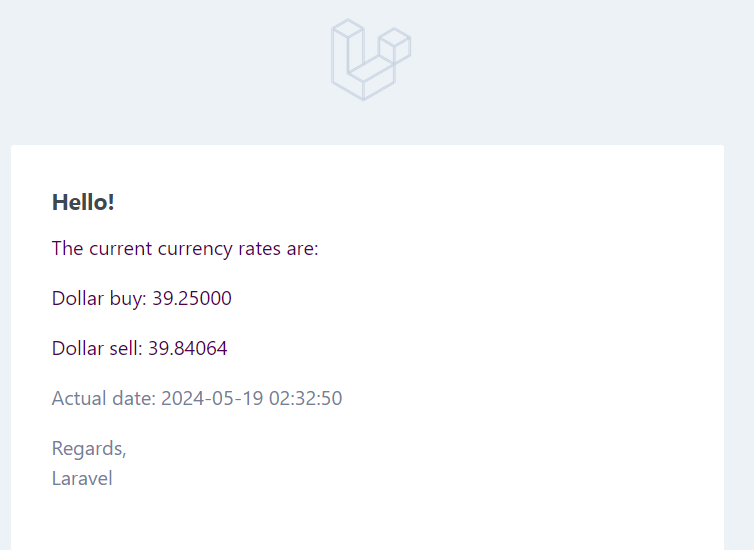

# Currency Api

Case | Software Engineering School

Stack for task PHP Laravel

laravel package I used are sail & breeze (most of breeze files i deleted for simplsity of project)

to run application you should clone repo, copy env

```bash
cp .env.example .env
```
(it may be generate after composer install but you need to set up stmp client anyway)

then execute

```bash
./vendor/bin/sail up -d
```

Or just
```bash 
sail up -d
``` 

(if you have alias for sail)

after conteiner is ready, run

```bash 
sail artisan migrate
``` 

and you can run task scheluding, but in order to get faster output you can just run command


```bash 
sail artisan app:notify-all-emails
``` 
## API Reference

#### Get current currency

```http
  GET /api/rate
```

### response (200 if ok, 400 if problem with external api)

#### Subscribe email

```http
  POST /api/subscribe
```

| Parameter | Type     | Description                       |
| :-------- | :------- | :-------------------------------- |
| `email`      | `email` | **Required,Unique**. Email to subscribe |

### response (200 if ok, 422 if email is not valid, 409 if email has already in db)


## Demo

flow -> i can get current currency & subscribe for it to recive letters every day

### rate examle

```http
  GET /api/rate
```

### reposonce

```json
{
    "dollarBuy": "39.25000",
    "dollarSell": "39.84064",
    "actualDate": "2024-05-19 02:27:44"
}
```

### subscribe example

```http
  POST /api/subscribe
```

### validation errors:

```json
422:

{
    "message": "The email field is required."
}

{
    "message": "The email field must be a valid email address."
}

409:

{
    "message": "The email has already been taken."
}
```

### success

```json

{
    "message": "Successfully subscribed to the newsletter!"
}

```

### email examle



